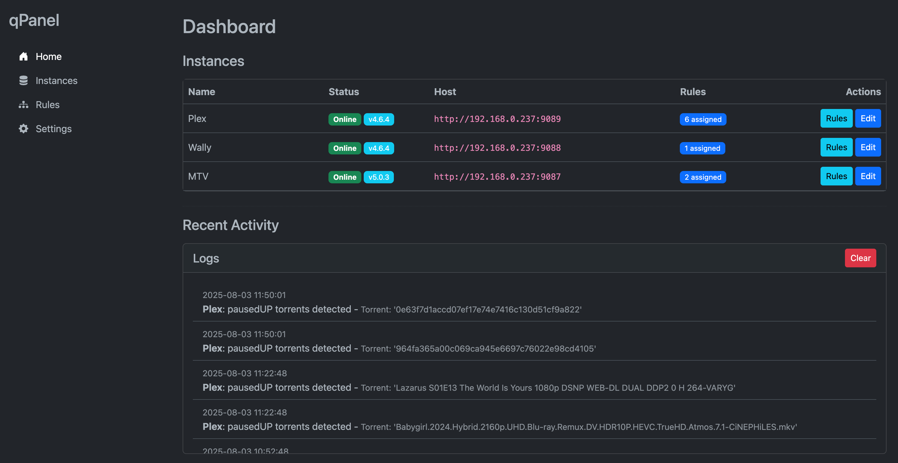

# qPanel

qPanel is a web-based management tool for qBittorrent, designed to automate torrent management tasks such as applying seeding rules, removing unused tags, and handling cross-seeded torrents.

The tool can:
- apply rules to torrents that match the specified criteria, for example:
    - If a torrent has tag `noHL`, set `Share Limit Time` to `43200 minutes`;
    - If one of the `trackers` is `bt.t-ru.org`, set `Max Upload Speed (KiB/s)` to `10`.
- tag torrents that don't have hard links with tag `noHL` (useful for torrent clients used by Sonarr/Radarr);
- look for deleted torrents in qBittorrent logs via API;
- pause cross-seeded torrents;
- tag "unregistered" torrents with tag `unregistered`;
- monitor for torrents in state `pausedUP`.



## Getting Started

### Prerequisites

- Docker
- Docker Compose

### Installation

1.  **Clone the repository:**
    ```bash
    git clone https://github.com/liamniou/qpanel.git
    cd qpanel
    ```

2.  **Create a `.env` file** to specify the port you want to run the application on:
    ```
    FLASK_PORT=5000
    ```

3.  **Run the application:**
    ```bash
    docker compose up -d
    ```

4.  **Access the application** by navigating to `http://localhost:5000` in your web browser.

## Configuration

All configuration is done through the web interface. Simply navigate to the "Settings" page to configure global settings, and the "Instances" and "Rules" pages to manage your qBittorrent instances and rules. 
